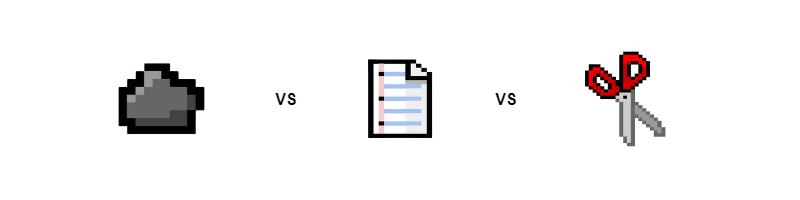
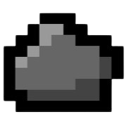
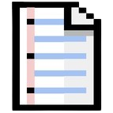
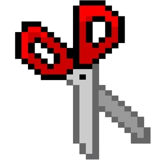

# 🗿 Rock, 📄 Paper, ✂️ Scissors Simulation

***



***


***

## 📜 About

This project is a visual simulation of the classic game Rock Paper Scissors. It uses Pygame to create an interactive environment where multiple "players" move around the screen, collide, and play Rock Paper Scissors against each other. The simulation includes a real-time scoreboard and a ternary plot to visualize the distribution of Rock, Paper, and Scissors over time.

Watch the demo: [demo 📽](docs/demo.mp4)

## 🚀 Features

- Dynamic simulation of Rock Paper Scissors gameplay
- Real-time scoreboard showing counts and percentages
- Ternary plot visualization of game state
- Customizable number of players and game parameters

## 🛠️ Installation

1. Ensure you have Python 3.11+ installed on your system.
2. Clone this repository:
   ```
   git clone https://github.com/johanlangman/RPS-simulation.git
   ```
3. Navigate to the project directory:
   ```
   cd RPS-simulation
   ```
4. Install the required dependencies:
   ```
   pip install -r requirements.txt
   ```
5. Run the simulation (see [Usage](#-usage) for instructions).

## 🎮 Usage

To run the simulation:

1. Navigate to the project directory in your terminal.
2. Run the main script:
   ```
   python main.py
   ```
3. Watch as the Rock Paper Scissors players interact on screen!
4. Close the window to end the simulation.

## ⚙️ Configuration

You can modify the following parameters in [constants.py](constants.py) to customize the simulation:

- `NUM_PLAYERS`: Adjust the number of players in the simulation
- `MIN_SPEED` and `MAX_SPEED`: Change the speed range of the players
- `GAME_FPS`: Modify the frames per second of the simulation

## 📊 Understanding the Visualization

- You'll see multiple players moving around the screen, represented by the Rock, Paper, and Scissors icons:


| Rock | Paper | Scissors |
|------|-------|----------|
|  |  |  |


- The scoreboard shows the current count and percentage for each type
- The ternary plot in the corner shows the distribution of Rock, Paper, and Scissors over time

## 🤝 Contributing

Contributions, issues, and feature requests are welcome! Feel free to check [issues page](https://github.com/Johandielangman/RPS-simulation/issues) if you want to contribute.

## 📝 License

This project is [MIT](https://choosealicense.com/licenses/mit/) licensed.

## 🙏 Acknowledgements

- Ternary Plot Inspired by [Primer](https://www.youtube.com/@PrimerBlobs)'s [Simulating the Evolution of Rock, Paper, Scissors](https://youtu.be/tCoEYFbDVoI)
- Visualization inspired by [Morigan](https://www.youtube.com/@morigan2770)'s [Rock Paper Scissors Simulation - Trailer](https://youtu.be/plOQ7n8VXNw)

---

Made with ❤️ by Johandielangman

[](https://buymeacoffee.com/johanlangman)